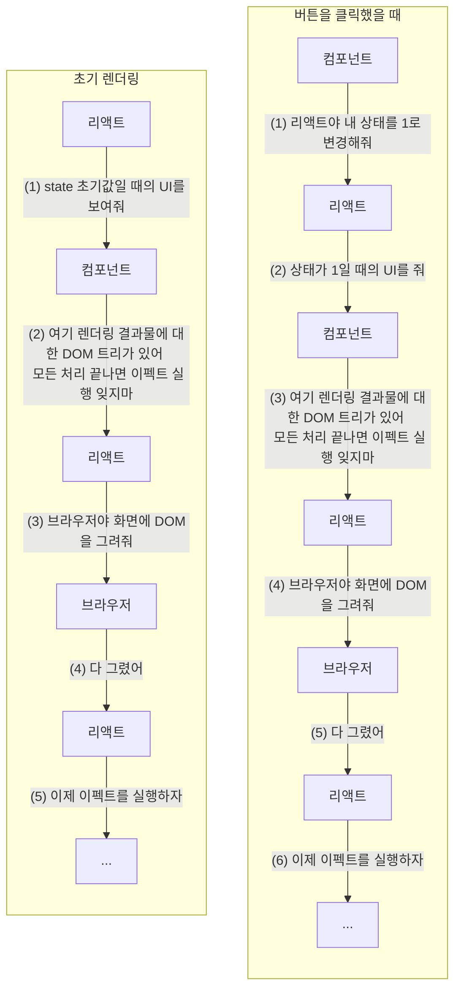

# useEffect

## 💁‍♂️ 질문 목록

```txt
Q1. useEffect는 무엇인가요?
Q2. useEffect는 언제 실행되나요?
Q3. useEffect에서 의존성 배열의 역할은 무엇인가요?
```

## 💁‍♀️ 답변 목록

<details>
<summary><strong>Q1. useEffect는 무엇인가요?</strong></summary>

useEffect는 컴포넌트가 DOM을 업데이트한 이후에 이펙트를 실행하는 훅입니다. 이펙트에는 데이터 가져오기, 구독 설정하기, 수동으로 리액트 컴포넌트의 DOM 수정하기 등이 있습니다. 이때 외부 데이터를 구독하는 경우나 DOM에 이벤트 리스너를 추가하는 것처럼 정리가 필요한 이펙트는 이펙트 함수의 리턴문으로 반환하여 정리합니다.

리액트는 컴포넌트를 렌더링할 때 우리가 이용한 이펙트를 기억했다가 DOM을 업데이트한 이후에 이펙트를 수행하는데 기본적으로 첫번째 렌더링과 이후의 모든 업데이트에서 수행합니다.

</details>

<details>
<summary><strong>Q2. 리액트가 useEffect를 실행하는 시점은 언제인가요?</strong></summary>

- DOM을 전부 업데이트 한 이후에, 브라우저 입장에서는 브라우저가 화면을 전부 그린 이후에 실행됩니다.
- 리액트는 컴포넌트를 렌더링할 때 우리가 이용한 이펙트를 기억했다가 DOM을 업데이트한 이후에 이펙트를 수행하는데 기본적으로 첫번째 렌더링과 이후의 모든 업데이트에서 수행합니다. 특히 리액트는 브라우저가 다 그려질 때까지 useEffect의 실행을 지연합니다.

</details>

<details>
<summary><strong>Q3. useEffect에서 의존성 배열의 역할은 무엇인가요?</strong></summary>

(problem) 모든 렌더링마다 이펙트를 적용하거나 정리하는 것은 성능 저하를 발생시킬 수 있습니다. (solution) 이때 의존성 배열로 최적화를 할 수 있습니다. (example) 예를 들어 의존성 배열에 값 A를 추가하면 값 A가 변하지 않으면 리액트는 이펙트를 건너뜁니다. (summary) 즉, 모든 리렌더링마다 이펙트를 실행하는 게 아니라 값 A가 변할 때만 이펙트를 실행하도록 만들기 때문에 성능적으로 최적화를 할 수 있습니다. 참고로 배열 내에 여러 개의 값이 있다면 그중에 단 하나만이라도 달라져도 이펙트를 실행합니다.

</details>

## 💁 추가 질문

> 질문 목록 외에 스터디하면서 새로 생긴 질문을 답변과 함께 적습니다.

<details open>
<summary><strong>Q. 다음 코드를 읽고 렌더링 과정을 설명해주세요. (첫번째 렌더링과 버튼을 클릭한 이후로 나눠서 설명해주세요)</strong></summary>

```jsx
function Counter() {
  const [count, setCount] = useState(0);

  useEffect(() => {
    document.title = `You clicked ${count} times`;
  });

  return (
    <div>
      <p>You clicked {count} times</p>
      <button onClick={() => setCount(count + 1)}>Click me</button>
    </div>
  );
}
```

<blockquote><details open>
<summary><strong>답변</strong></summary>

첫번째 렌더링:

1. 리액트: "state가 0일 때의 UI를 보여줘."
2. 컴포넌트:
   1. "여기 렌더링 결과물로 `<p>You clicked 0 times</p>`가 있어."
   2. "그리고 모든 처리가 끝나고 이 이펙트를 실행하는 것을 잊지마: `() => { document.title = 'You clicked 0 times' }`"
3. 리액트: "좋아. UI를 업데이트하겠어. 이봐 브라우저, 나 DOM에 뭘 좀 추가하려고 해."
4. 브라우저: "좋아, 화면에 그려줄게."
5. 리액트: "좋아 이제 컴포넌트 네가 준 이펙트를 실행할거야."
   1. `() => { document.title = 'You clicked 0 times' }`를 실행하는 중.

버튼을 클릭했을 때:

1. 컴포넌트: "이봐, 리액트. 내 상태를 `1`로 변경해줘."
2. 리액트: "상태가 `1`일 때의 UI를 줘."
3. 컴포넌트:
   1. "여기 렌더링 결과물로 `<p>You clicked 1 times</p>`가 있어."
   2. "그리고 모든 처리가 끝나고 이 이펙트를 실행하는 것을 잊지마: `() => { document.title = 'You clicked 1 times' }`"
4. 리액트: "좋아. UI를 업데이트하겠어. 이봐 브라우저, 나 DOM에 뭘 좀 추가하려고 해."
5. 브라우저: "좋아, 화면에 그려줄게."
6. 리액트: "좋아. 이제 컴포넌트 네가 준 이펙트를 실행할거야."
   1. `() => { document.title = 'You clicked 1 times' }`를 실행하는 중.



</details></blockquote>

</details>

<details>
<summary><strong>Q. 리액트가 이펙트 정리(cleanup)를 왜 마운트 해제할 때 한 번이 아니라 모든 리렌더링마다 할까요?</strong></summary>

prop이나 state가 변하면 컴포넌트를 새로 렌더링하게 되는데 만약 이펙트가 예전 렌더링을 참조하고 있으면 버그가 발생할 수 있습니다. 예를 들어, id prop이 100에서 200으로 바뀌었는데 구독을 설정하는 이펙트는 여전히 100을 참조하고 있으면 버그가 발생할 수 있습니다. 하지만 리렌더링할 때마다 이펙트 정리를 해주면 id prop이 100에서 200으로 바뀌었을 때 100을 구독해제 하는 이펙트 정리 함수가 실행됩니다. 이렇듯 컴포넌트가 업데이트될 때마다 이펙트뿐만 아니라 이펙트 정리도 업데이트하는 것이 리렌더링에서 (이전 렌더링 때의 값을 참조하여) 발생할 수 있는 버그를 예방할 수 있습니다.

</details>

## 📚 함께 읽기
